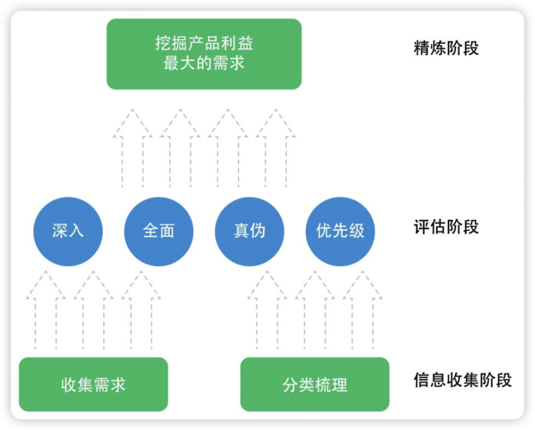
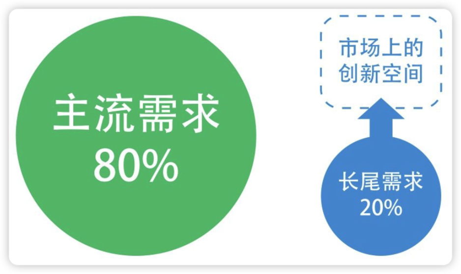
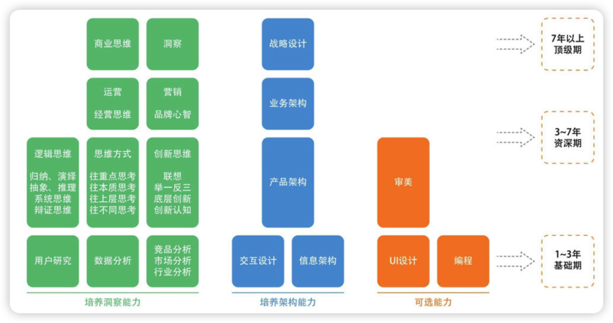
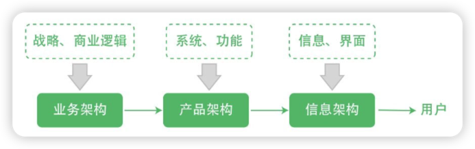
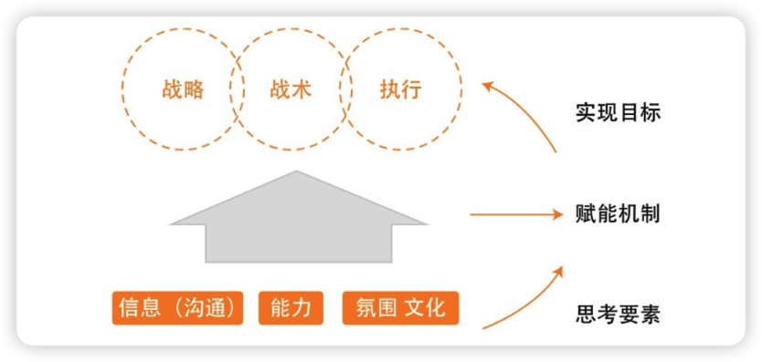
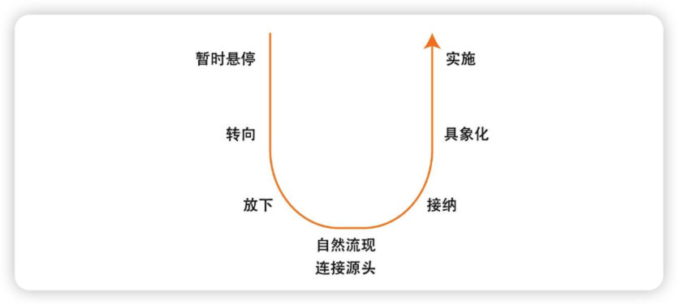
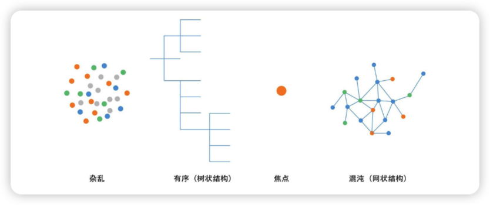

[[toc]]

# 1、产品经理的关键四要素：

- 创业：有创业的心态，才能顶住压力，坚持
- 求知：强烈的求知欲，对新鲜事务的好奇心，终身学习
- 联想：洞察能力（夯实基本功：用户分析，数据分析，市场分析）、归纳演绎能力
- 善断：在复杂变化的互联网场景或者意见分歧的时候能做出最有利于产品目标的决策

# 2、如何了解用户

> **《设计心理学》**
>
> **《用户体验要素》**

## 用户研究方法

- 深入访谈：找典型目标用户聊天
- 焦点小组：由一名主持人和一组用户（通常不超过8个人）在一个主题下进行访谈（焦点小组有可能会使用户说“假话”：为了面子、为了和别人不一样、为了隐私而隐藏自己的真实想法，需要避免这种情况出现）
- 问卷调查：一种定量研究
- 可用性测试：在一定的时间段内，通过请用户实际使用，以此来发现产品的问题并提出改进意见
- 留置研究：用户在实际场景里使用得出的，用户在这一过程中记录自己的使用感受、回答调研问题等，对产品的反馈更加完善和真实

## 用户研究需要考虑以下三个关键因素

- 用户是否是典型的目标用户？
- 挖掘到的信息是否真实？
- 怎么将用户研究的结论应用到产品设计中？

## 具备同理心，洞察心理和人性

> **《社会心理学》**

### 了解爱现心理

爱现心理即希望展现自己，或者叫成就感、认同感。

分析爱现心理，需要考虑以下几个方面：

- 每个人都有爱现心理，但为此付出的努力程度不同。
- 求之而不得，则会贪嗔痴。用户会为了满足自己的爱现心理而乐此不疲，付出很多努力，但求之不得的时候，就会变得贪嗔痴。
- 人总会有疲惫的那一天，穷极一生的为自己的兴趣而奋斗的人屈指可数。

### 群体用户心理

- 群体极化，会更加认同观点
- 向心力越强，群体越紧密，同时与外界也更加界限分明
- 适当允许不同群体间发生矛盾。适当的矛盾能让群体更加活跃，从而提高整个产品的活跃度。
- 留住群体中的意见领袖

### **如何在日常生活中培养自己理解用户、理解需求的能力？**

- **培养同理心**
  - 觉察自己：在自己对事、对人的反应中捕捉到自己行为背后的想法和原因，多问自己为什么，看到自己言行背后的起念动心，究竟是什么让自己潜意识的立即产生了某个反应？要跳出自我的影响，成为一个旁观者来剖析自己
  - 学习体察他人的感觉：将自己与用户的感受和表达方式区分开，避免受影响。要去想他如此表达背后的原因和想法是什么。观察用户，与用户聊天，以此来锻炼自己体察别人的能力。
- **设身处地的想：** 站在用户的角度去理解、感受他们的想法。积累对用户的感知，在具体的产品设计需求判断过程中运用对场景的预设和提问，来体察用户在这些场景下可能会有的反应。
- **发展多方面的兴趣，多出门食人间烟火：** 互联网隔了一层面纱，用户都是带着或大或小的面具在网络上生存，要想真实的了解不同的用户，就要走出家门。
- **玩RPG网游，短时间内体验人生**
- **从垂直到普适是非常漫长的过程：** 理解某一方面用户群体的需求和心理到理解普罗大众的需求和心理，这是一个漫长的过程，没有捷径，需要在成长的过程中保持体察用户的习惯，不断积累。

# 3、需求分析方法论

需求的本质就是———人人都可以参与讨论，人人都觉得自己理解需求

> 需求分析的常见工作图，一个需求分析方法的金字塔

## 收集需求

- **不要拒绝来自任何人的需求**，在收集需求时，需要将需求与身份、动机等区分开来，在之后分析需求的时候再考虑它们
- **从各个渠道获取需求**，包括但不限于产品内的反馈系统、新浪微博、知乎、微信群等
- **需求要有逻辑地进行组织**
  - 方便记录、检索，避免遗忘
  - 通过组织良好的需求池宏观的观察产品发展阶段的状态，结合当前和长远目标，更好的做优先级决策
- **需求也是符合二八原则的，80%的人提出的都是20%的需求。**在一个充分竞争的市场中，越是主流的需求，越是被充分挖掘，也就越显得竞争力不够。而那些尚未被发掘的需求，才可能是创新的所在

  

  > 长尾需求

## 探寻需求背后的动机

- 用户究竟为何要提出这个需求，背后的原因是什么？
- 假设老板提了一个不靠谱的需求，如何说服他呢？
  - **当某一个层面上无法达成一致时，往前推一个层面，在目标层面或者更深的层面上达成一致，然后分析两个层面之间的路径是否一致，目标、路径一致就更容易沟通。** 同时在沟通的过程中，辅以数据分析、调研情况，尽量将主观的沟通讨论引导到客观的分析说明上，这样的沟通就不会是观点、想法之争，面红脖子粗的场面也不会经常出现。
  - 如果想要说服老板批准执行需求，先**从双方的目标入手，目标达成一致之后再通过有条理的路径逐步分析需求**
  - 总之，就是**任何可能不在一个频道上的沟通，都需要先将沟通的双方调整到一个频道上**

## 评估需求实现的影响

- **分析一个需求的影响面：** 每个需求也会与其他需求相关联，甚至牵一发而动全身
- **分析一个需求的利弊：** 每个需求的实现都有利弊，是双刃剑

## 判断需求的真伪、有效性

从多个角度考量一个需求，角色、场景、流程方法

- **角色**：对同一个功能，不同角色的需求不一致。
- **场景**：分析需求真实发生的场景，考虑实际情况。
- **流程**：分析满足需求的关键路径，判断能否满足。

## 符合产品目标

> 机会都是探索出来的，很少是规划出来的

如何去判断哪些需求先做、哪些需求后做，甚至不做呢？

- 需要考虑需求与产品本身目标、定位的匹配程度
- 实现需求需要对产品有利，不能光满足用户，还需要满足产品的利益
- 产品目标通常分为短期目标和长期目标，长期目标与产品定位和战略挂钩，产品经理应当在日常工作中多多思考，思考眼前的短期目标需求与长期目标需求之间的精力投入占比至少应该达到1:1，这样才能最终让产品实现战略目标

## **四两拨千斤**

如何低成本的快速获取大量目标用户，而不是与竞争对手打持久战？

一个有效的办法是深入思考用户的需求重点、竞争对手真正薄弱的地方、自己能发挥巨大优势的地方，将这三者结合起来。

- **用户的需求重点：** 通常是用户选择产品时的需求痛点，或者用户迁移时的主要成本所在。
- **竞争对手真正薄弱的地方：** 竞争对手可能在某些地方有优势，但不要放过竞品的每一个弱点，并且要放大这些弱点。
- **自己能发挥巨大优势的地方：** 结合上面两个考虑，将它们转化成自己产品的优势，就可以拨动千斤之重的竞争对手的用户群。

## **用户口碑**

### **超出预期**

口碑的产生源自超出预期的满足了用户，带给了用户惊喜感。

**如何给用户惊喜感？**

- **快：** 在新事物出现的时候，你的产品是第一时间跟进的，甚至这个新事物就是你们创造的，那么感兴趣的用户会产生惊喜感
- **深：** 只要功夫深，铁杵磨成针。在细节上做深入思考与设计。
- **不同维度：** 在不同维度上，与用户最基本的感受拉开差距。

### 乐意传播

用户口碑最明显的特征就是用户会在自己的圈子里传播。

**如何引起用户传播？**

- **感同身受：** 即用户心理所谈论的——共鸣
- **打开眼界：** 人都有好奇心，未知而有趣的东西容易引发传播
- **展示自己：** 即用户心理所谈到的——爱现（希望展现自己）或者叫成就感、认同感

> **产品经理需要有一定的市场思维，这样才能更好的捕捉到用户乐意传播的点。在分析需求的时候，需要提前考虑传播，这样才能更好的打造口碑。**

### **大体量的用户**

满足大体量的用户需求，产生的口碑会有巨大的能量。如果人人都这样说，那用户口碑就会进化成一种潮流，品牌价值就会提升很多，相应的会带来巨大的用户增长。

# 4、产品经理的基本功

> 产品经理技能树

## 数据分析

> 《精益数据分析》

产品经理不需要成为数据分析的专家，但是需要回答以下几个问题：

- 什么时候分析数据？
- 分析哪些数据？
- 如何分析数据？
- 如何使用数据辅助决策？
- 如何使用数据驱动业务？

对于一个数据分析方面的一些感悟：

- 不能只看大数据，需要精细化分析。
- 需要看数据的变化、趋势。产品经理需要有敏锐的发现数据趋势的能力。
- 需要对比数据，做到心中有谱。这里最普遍的问题是，是否知道某项数据的天花板在哪里。对于一个数据，我们需要将其和天花板、大盘作对比。
- 找到关键数据（北极星数据）
- 数据约等于效率的意识，数据分析帮助产品经理做决策，甚至 A/B 测试可以代替产品经理做部分决策，这些都是为了降低决策的失误率和风险，将人的脑力用在更合适、更有深度的地方——洞察。

## 交互设计和信息架构

> 《界面设计模式》《信息架构：超越 web 设计》《点石成金》
> about face 系列

产品经理需要具备出色的**抽象**和**具象**能力

- 抽象运用在系统级别的思考上
- 具象运用在用户体验级别的思考上

**具象层面**：

- 交互设计最关键的是考虑用户认知、使用场景
- 不断积累自己熟悉的设计模式

**抽象层面**：

- 思考用户与信息、内容、服务……的关系
- 考虑复杂的多路径，设计整体的信息架构

从具象层面来说，交互设计就是在做用户在界面上的操作、对信息的获取，从抽象层面来说，其实就是在分析、设计用户与信息的关系

## 审美能力

审美能力对产品的影响范围分为三层：

- **视觉、体验层**
- **用户行为、产品层**
- **价值观、世界观层**

# 5、在激烈的竞争中寻找产品定位

在竞争市场中确定产品定位至关重要，因为他决定了

- 产品能否在开始阶段活下来
- 产品今后发展的天花板

做产品定位的方法论：

- 分析行业、市场、竞争对手，从抽象到具象一步步的剖析你的产品所处的环境
- 寻找产品的切入点，结合外部的额分析和自身用户群、优势的分析，找到产品打开市场的切口
- 在切入点的基础上，对产品定位和长期发展做出阶段性的规划，并设计扩张的接口
- 整套方法论中最关键的当属‘变化’二字，机会往往处在变化之中

## 看清一个行业

> **机会往往出现在未来会发生巨大变化的行业之中**

作为产品经理，思考产品定位的第一步就是要弄清楚自己产品所处行业的情况，这是发现机会的开始：

- 这个行业有哪些玩家？他们之间的关系是怎么样的？
- 未来几年，这个行业会发生什么变化？在这些变化中会产生什么机会？
- 行业里的玩家会如何抓住变化中的机会？

想要弄清楚以上的问题，除了自己刚好身处这个行业之中，特别熟悉、了解行业外，每个产品经理都需要进行大量的研究，翻阅大量的资料，与此同时，还需要具备国内外类比、不同行业类比等各种举一反三的能力。

## 分析市场的竞争局面

产品经理在清楚的了解一个行业之后，需要对市场的竞争局面进行细致的分析

分析市场时，从以下三个方面考虑：

- 这个市场的相关市场是什么？他的上下游有哪些？谁是平台，谁是应用？
- 这是一个零和市场吗？有没有办法做非零和市场？
- 这个市场未来的变化是怎样的？应该如何抓住机会？

> 眼界是产品经理非常重要的高级素质

### 市场分析的方法：

- **分析市场的上下游**：上游和下游同时有着竞争和合作的关系。下游市场在用户基数变大之后，势必会向上发展，从而更多的影响整个行业；上游市场在掌握了资源之后，也势必会向下发展，去拓展更多的渠道。
- **分析平台和垂直应用**：平台可以支撑垂直应用发展，垂直应用发展壮大之后可以成为平台。
- **探寻非零和市场**
- **分析市场中的变化机会**：在互联网发生剧烈变化的今天，我们需要带着变化的眼光去看几乎所有的事情。市场分析是前期确定产品定位的重要工作，如前文所述，它是产品后续能否发展的关键。市场中的变化机会往往因用户的需求发生变化，而需求的变化主要来自需求越来越丰富、出现新的消费形式等。

> 《从 0 到 1：开启商业与未来的秘密》

过度关注竞争可能会导致对业务和用户的关注减弱，产品经理在运用时，需要注意不要被市场竞争牵着鼻子走，所有的研究和分析最后都应该服务于产品经理对用户需求和产品自身的判断和策略，在做具体决策时，市场分析只是众多考虑因素中的一环。

## 如何做到对竞争对手了若指掌？

首先最终要的就是数据和用户反馈，竞品做了哪些功能，这些功能的数据表现如何？用户评价如何？通过足够多的客观信息，了解竞争对手，甚至比他们自己更了解。

竞品分析是贯穿产品经理工作始终的，对一个产品的深入了解不是一次性的，而是需要日积月累的加深，最终才能达到了若指掌的程度。竞品的不断发展、变化也要求产品经理持续地跟踪、了解。我们通过竞品的变化，揣摩它业务方向的调整、发展，它的财务情况，它团队的变化。这些对于产品经理来说都是很重要的信息，有利于把握竞争局面。

书中总结了从产品、用户、数据三个角度去分析的方法：

### **数据方面**

- 竞品整体数据，了解竞品在市场中的体量和位置
- 竞品数据趋势，了解竞品整体数据的变化趋势

### 用户方面

- 竞品核心用户，熟悉竞品最忠诚的用户群
- 竞品主流用户，熟悉竞品占比最大的主流用户群
- 用户构成，熟悉竞品各类用户群的构成比例

### 产品方面

- 竞品核心竞争力，分析核心功能的特点、详细数据情况、用户评价
- 竞品主要功能，分析竞品的主要功能特点、详细数据情况、用户评价
- 竞品发展趋势，了解竞品过去、现在、未来的功能发展走向

以上三个方面并不是割裂的，在我们分析一个产品的时候。我们往往会同时分析他的功能、数据和用户。其中最关键的就是对数据和用户行为、评价的挖掘。

从数据层面，我们可以通过**行业数据报告（日活跃用户数、周活跃用户数、月活跃用户数）、第三方统计机构、百度指数、微指数，产品在各大应用市场的排名和下载量**等，去看他的整体数据，以上述渠道获取的数据作为参考数据，来判断当前产品在市场中的体量和位置。

在分析整体数据的同时，我们还需要看到产品的变化趋势，比如**产品在过去一年中的活跃用户增长情况、使用市场情况、各个重要产品迭代时间点前后的数据变化、重要的市场营销行为对产品知名度的影响**等等。

了解清楚整体数据之后，接下来就需要开始挖掘产品功能的详细数据，通过查看功能的详细数据，我们可以清晰的看到一个功能是否命中了用户需求、是否表现很好。

随着对功能的分析、研究越深入，会让我们掌握真实的用户信息：

- 了解产品的核心用户群，也就是最忠实的用户、粘性最高的用户，他们可能会用到一个产品的 80% 左右的功能
- 了解产品的主流用户群，大部分用户只使用了产品的 20% 左右的功能
- 了解产品的不同用户群构成

## 如何在充分竞争的市场中找到产品的切入点？

产品最难的地方就是从 0 到 1，而从 0 到 1 最难的地方就在于寻找产品切入点，为什么难？因为是市场形势和用户需求始终处于变化之中，不同市场之间的差异也很大，任何一个产品寻找切入点都不容易。

文中提到的寻找切入点的方法：

- 细分：足够尖锐，切开一道口子
- 新兴：足够前瞻，未来改变现在

> 《跨越鸿沟：颠覆性产品营销圣经》

## 以切入点考虑产品架构

尽管我们通过种种分析找到了产品切入点，弄清了产品定位，但也不意味着我们就能设计出一款好产品，从而赢得用户的喜爱，在整个设计过程中，产品经理对于其核心——产品架构的把控，是至关重要的。它就像是骨架，支撑起整个产品的发展。

在设计最终的产品架构时，需要考虑一下方面：

- 产品瞄准的细分市场
- 产品的发展方向
- 产品的核心功能
- 信息架构

# 6、思维方式

## 往重点思考

如何抓住重点？

- 思考关键目标 ——  权衡关键目标，每个阶段只有一个
- 思考关键行动
- 思考关键依赖

## 往本质思考

- 跳出思维习惯，培养、锻炼出好的思维方式，让自己不要轻易地落入思维习惯
- 一层一层往下多提问题
- 日常实践并与人交流

## 往上层思考

- 看上层的格局和眼界
- 思考上层与本层之间的逻辑关系
  - 模块和系统之间的关系
  - 商业、经济上的驱动关系
- 想象未来的可能性

## 往不同思考

> think big，think different

- 客观地思考不同
- 逆向思维
- 捕捉创新
- 形成自己独特的思维框架

# 7、产品架构能力

## 什么是产品架构

产品架构是架构产品，对象是从用户需求、商业需求中产生的各种产品功能，产品架构则是将这些不同的功能围绕目标进行分类、整合。

对于产品功能之间的关系，应该思考以下几个点：

- 分类聚合：从目标出发，将满足同个或者同类用户需求、商业需求的产品功能聚合在一起
- 用户流程：比如，电商的购物流程、一个活动的参与流程等，一个流程上的功能之间是上下游的关系，需要串联起来。
- 相互配合：除了考虑分类和流程外，在产品架构的系统中，我们还要考虑不同功能（组）之间的配合。将同个或者同类流程的功能架构在一起可以理解为编成一个组，思考组与组之间的关系。

在产品架构方面，应该考虑以下几个要点：

- 用户易理解，产品架构符合用户的认知和预期（不要让用户思考）
- 高效、易用，带给用户爽的感觉
- 追求简练的架构，同时也需要思考对用户需求的满足是否到位，不要过度追求简练
- 扩展性强，优秀的产品架构能低成本、快捷地支持功能扩展

> 最美的架构应该是能够用非常简单的话语就阐述清楚的，而不是只有专家才能理解的复杂局面

## 信息架构、产品架构与业务架构

三者之间的关系：递进式的

- 信息架构是最前端的表现层架构，即是将业务架构、产品架构中明确的产品要点，以适合的方式呈现在用户面前
- 产品架构是连接业务与用户表现层的产品功能、系统的架构，即是我们在产品系统的设计上如何抽象、整合，以最适合的架构去支撑业务
- 业务架构则是包含商业逻辑在内的业务运转机制的架构，即是设计以什么业务作为驱动轮，以及业务之间如何相互配合达到整体发展的目的，同时包含业务的商业模式设计

# 8、产品负责人的三个能力

## 商业嗅觉及推理能力

对产品扩张、商业化的敏锐感觉，以及推导出为何能获得更大的发展、如何能发展壮大

> 互联网广告模式
> 注意力时间转化为商业价值模式

在日常工作和生活中需要多钻研大大小小不同的商业模式，分析其中的逻辑，找到其中共性的部分，然后在实际工作中不断思考应用，来培养自己的商业嗅觉

## 业务架构及创新能力

规划、实施复杂的业务架构，通过产品、运营、市场的多维度布局来打通用户对产品特性的认知

创新是基于深刻的用户洞察和行业洞察而产生的，我们需要不断的加强自己的洞察能力，加强对底层逻辑的思考能力，方能做出影响面更大的创新

## 善于沟通及领导能力

鼓舞、带领团队向战略方向前进，克服非常之困难，完成非常之突破

赋能的机制

- 业务：通常将业务划分为战略、战术、执行三个环节。团队、信息、能力、氛围等都是围绕业务目标来设计的
- 团队：在复杂产品组织中，我们可以围绕业务在整个产品层面建设三个团队—— 战略团队、战术团队、执行团队
- 信息：在整个产品组织内共享信息，信息是赋能生效的基础之一，信息不对称经常会导致决策失误
- 能力：除了前文提到的一些能力，我们还要结合业务的阶段总结来帮助团队提升能力
- 氛围：赋能组织非常需要相匹配的文化氛围。赋能强调的是激发团队的主观能动性，自发的创新，而非受奖金、职位驱动完成工作。只有团队真正参与公司业务的经营管理并且组织中提倡相应的文化，大家才有兴趣和动力挑战更高的目标

文中所提倡和坚持的文化氛围：

- 热爱自己从事的工作并发展成兴趣
- 大局观
- 脚踏实地
- 心胸宽广
- 喜欢学习
- 无私分享

不提倡和禁止的：

- 强烈的等级观念
- 固步自封
- 害怕失败
- 过于看重个人利益
- 缺乏雄心

# 9、产品之路时学时新

产品之路没有终点，社会在发展，在不断的进步，我们的知识、能力也需要不断的学习、更新。

## 以人为镜，可以明得失

- 打开自己，有一个积极开放的心态。多听、多等、多想。
- 从别人身上看得见自己。一个人过往的成功越耀眼，光环下的阴影面积就越大，固有认知通道就越顽固，认知盲区就越多。一旦环境发生变化，这些在大量的经验中习得的思维习惯反而跟有可能让人深陷泥沼。
- 辩证地看待自己

## 突破瓶颈

U 型理论

突破瓶颈实际上是在与我们的天性做对抗，让自己从害怕失败和未知的心理中跳脱出来，放下既往的经验和认知，重新感知周围的环境并思考未来会如何。当这样的心流涌现时，我们就会有新的想法和新的行动，而突破瓶颈就成为顺其自然的事了

## 吾日三省吾身

从入门到精通的四个递进状态

# 扩展书目

1 《穷查理宝典：查理·芒格智慧箴言录》

2 《定位：有史以来对美国营销影响最大的观念》

3 《失控：全人类的最终命运和结局》

4 《设计心理学》

5 《情感化设计》

6 《用户体验要素：以用户为中心的产品设计》

7 《社会心理学》

8 《精益数据分析》

9 《界面设计模式（第2版）》

10 《信息架构：超越Web设计（第4版）》

11 About Face系列

12 《点石成金：访客至上的Web和移动可用性设计秘笈（原书第3版）》

13 《从0到1：开启商业与未来的秘密》

14 《跨越鸿沟：颠覆性产品营销圣经》

15 《参与感：小米口碑营销内部手册》

16 《疯传：让你的产品、思想、行为像病毒一样入侵》

17 《竞争优势》

18 《U型理论：感知正在生成的未来》
