[[toc]]

## 社交产品的前世今生

- 人生而热闹，却无往不在孤独之中 —— 马尔克斯《百年孤独》

SNS：社会化、社交网络服务

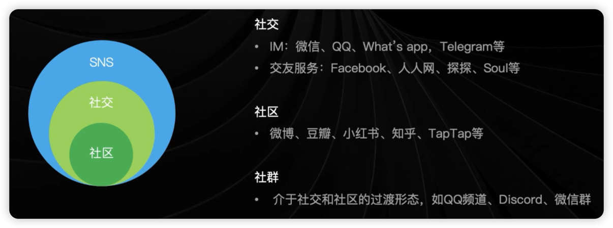

### 社交产品和社区产品的区别

社交产品：侧重于找人，强调建立关系，先有交流

社区产品： 侧重于内容，强调共同话题，现有内容，再产生交流

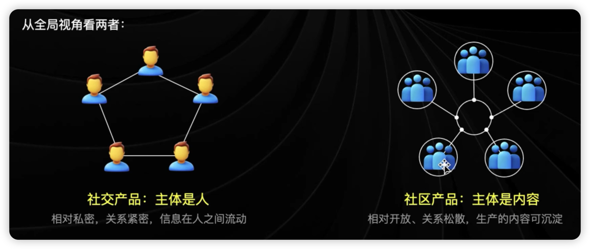

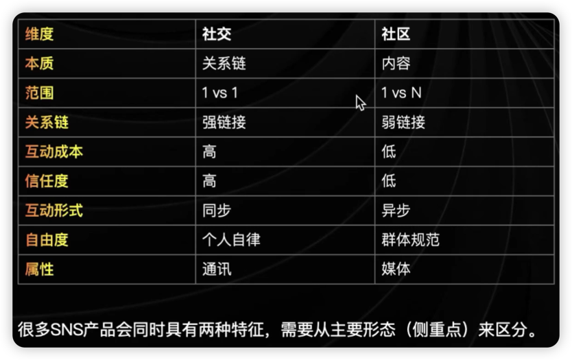

### 社交需求的源动力

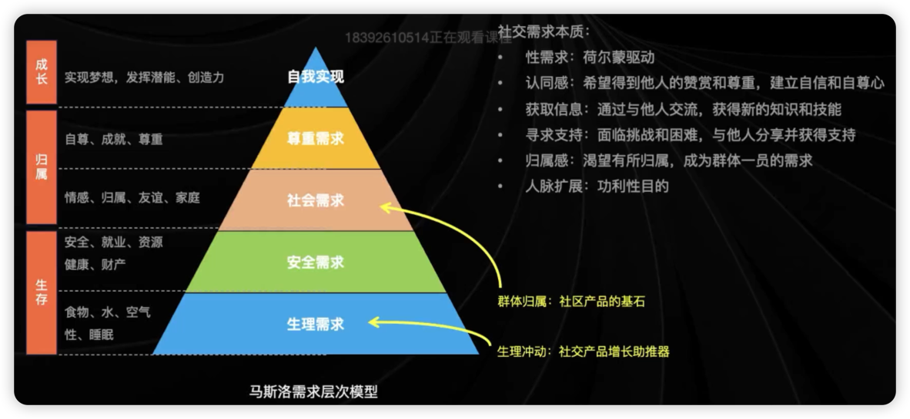

### 社交需求本质：

- 性需求
- 认同感
- 获取信息
- 寻求支持
- 归属感
- 人脉扩展

### 社交需求如何满足：

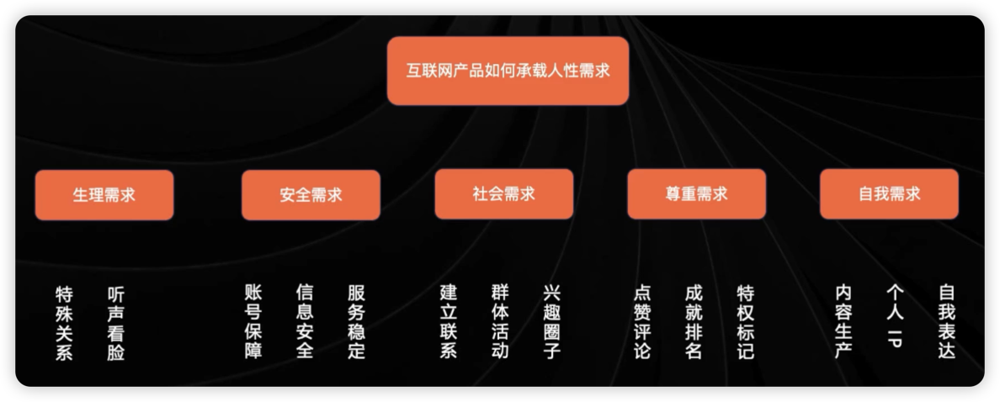

- 生理需求
- 安全需求
- 社会需求
- 尊重需求
- 自我需求

### 社交产品的发展

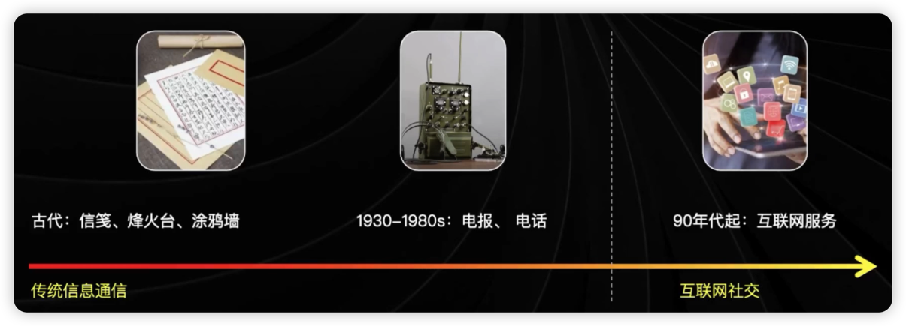

社交产品的发展历程：

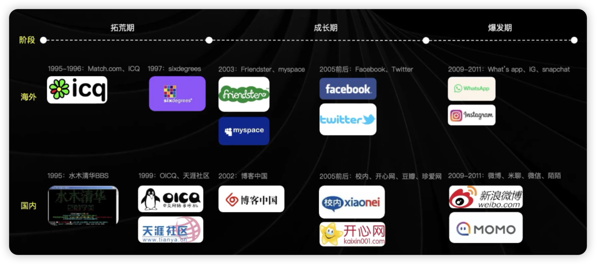

### 社交产品形态变迁

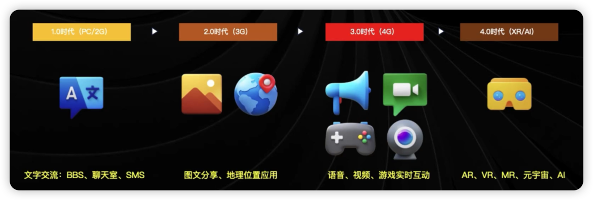

技术的变革导致社交的形式，媒介也随之改变，沉浸感越来越强

### 社交产品的分类

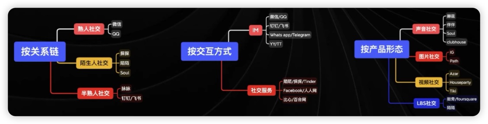

产品生命周期（PLC 模型）

探索期-成长期-成熟期-衰退期

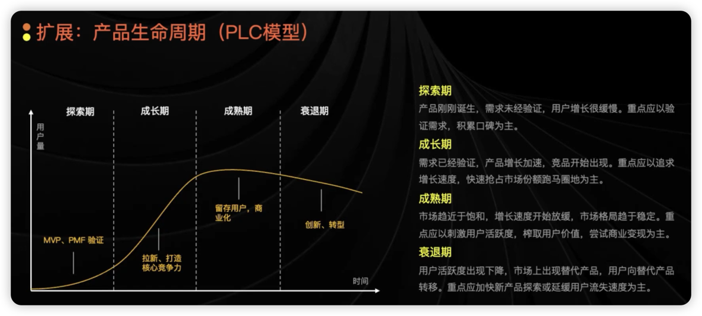

明确产品生命周期所处阶段，需要指定不同的产品迭代计划和运营策略

### 如何判断产品所处的生命周期阶段？

有以下维度：

- 用户体量
- 功能架构
- 用户增长

## 社交产品的基础理论

- 你是与你相处最多的五个人的平均值——吉姆·罗恩

### 六度分隔理论

Six degrees of separation

你和任何一个陌生人之间所间隔的人不会超过六个，意味着最多通过六个人你就能认识任何一个陌生人。（美国社会心理学家，斯坦利·米尔格兰姆，1967 年提出）

### 150 定律

Rule of 150

大脑认知能力限制了物种个体社交网络的规模，人类智力将允许我们拥有稳定社交网络的人数约为 150 人。（英国人类学家，罗宾·邓巴，20 世纪 90 年代提出）

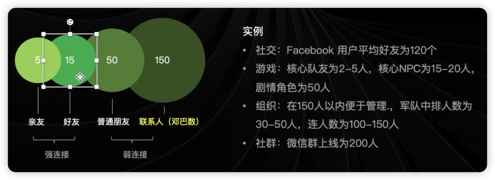

重点关注用户的好友关系链数量是否符合邓巴数定律，保证信息传递通畅。

### 网络效应

Network Effect

指如果有一种产品或者服务，他会随着每一个用户人数的增加，自己本身的价值也会增加。（以太网之父，罗伯特·梅特卡夫，90 年代提出）

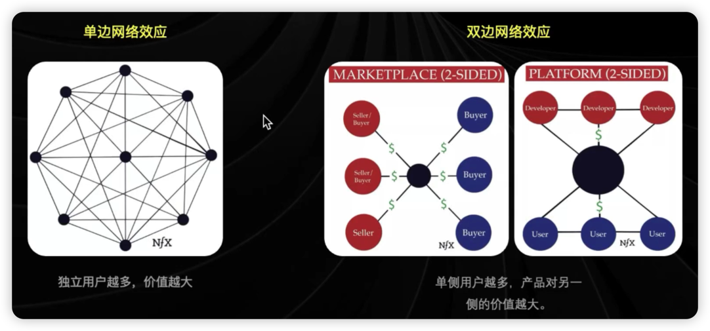

## 社交产品的设计

- 社交是一场信息交互的运动——张一鸣

### 社交产品的核心要素

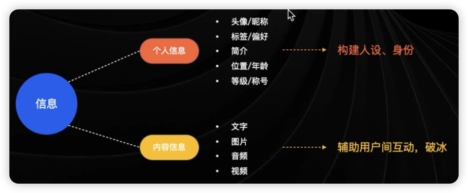

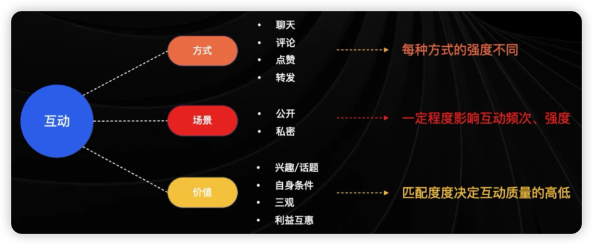

用户间的互动影响关系链的稳定以及强弱：互动方式和频次可调节亲密度，但核心取决于互动价值。

- **扩展: 福格行为模型**

    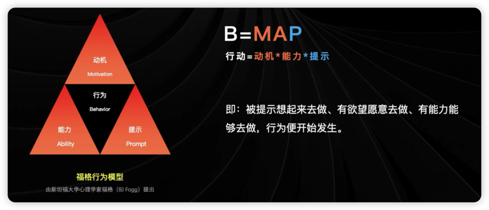

    

    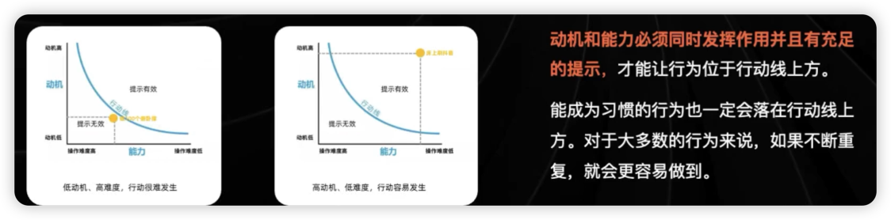

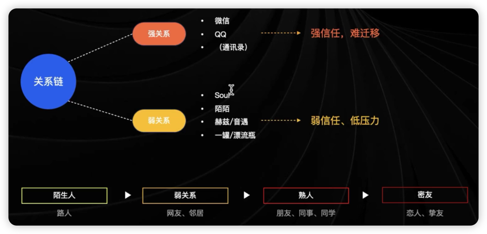

### 社交产品的底层设计

#### 线下社交路径：

#### 线上社交路径：

#### 业务核心流程：

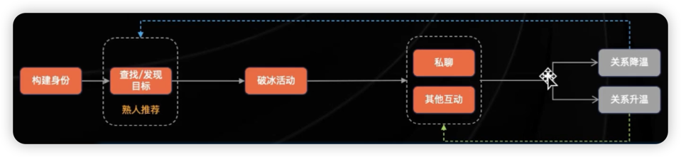

- 发现

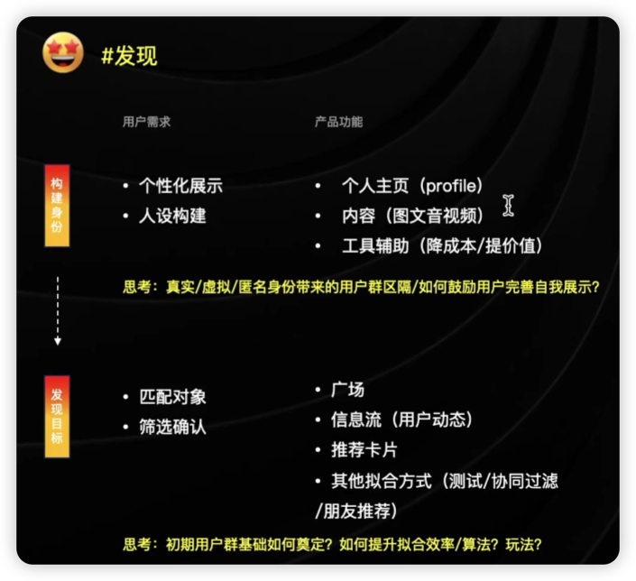

匹配效率/数量、质量、互动体验，这三者往往很难并存。

- 破冰

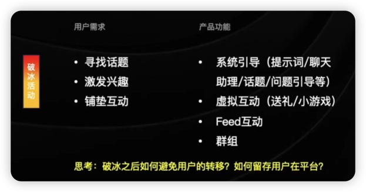

- 互动

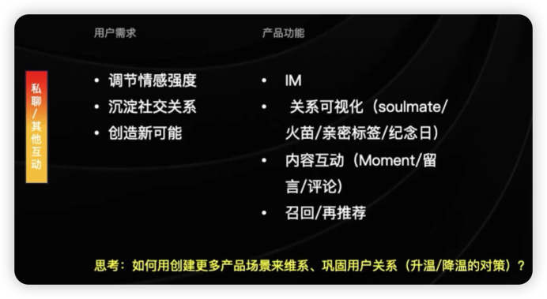

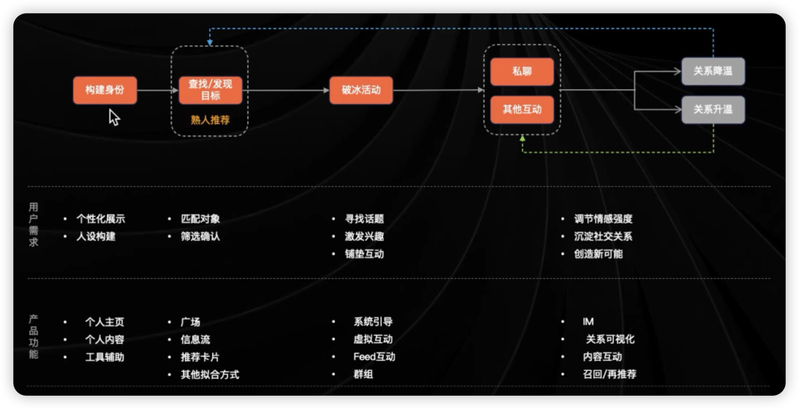

### 社交产品的商业模式

- 广告

    向企业或品牌提供广告投放服务

- 电商

    自营或者第三方电商合作，提供商品推荐、社群营销

- 增值服务

    虚拟物品销售，高级会员服务

- 数据服务

    向 B 端出售用户的分析数据

### 社交产品的困境

