[[toc]]

> 📝 产品学习笔记

## 社区产品概述

互联网社区是指聚集了具有相同兴趣、文化偏好、价值观的社会群体的网络交流空间

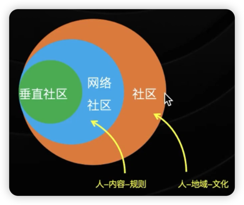

- 传统社区：社会生活共同体，强调地域性
- 网络社区：将传统社区的区域范围发展倒了网络，无视地域，降低沟通成本，为人们提供了一个新的交流平台

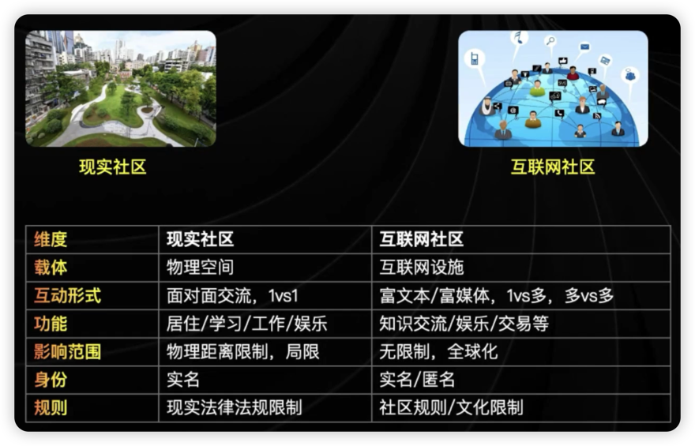

### 社区产品的定义：

什么是社区？

- 兴趣相投的人，在规则，文化指引下，进行内容生产和消费的平台

社区产品的主体是内容，侧重于找内容，强调共同话题

比如：小红书、B 站、豆瓣、快手、抖音

### 社区产品发展史：

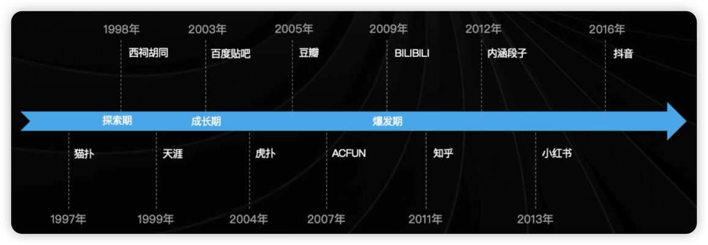

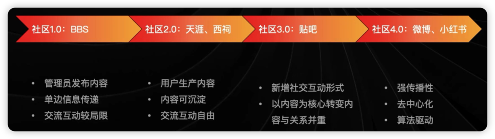

### 社区产品的分类

按照内容生态分：

- 图文社区：IG
- 音频社区：荔枝，蜻蜓FM
- 视频社区：快手、抖音、B 站

按功能形式分：

- 问答
- 论坛、频道
- 博客、微博客

按覆盖范围分：

- 垂直型
- 综合型

按生产方式分：

- UGC
- PGC
- OGC

### 主流社区产品介绍：

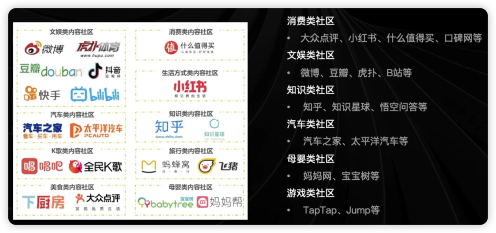

### 社区产品和社区功能：

社区产品：整个产品以社区的形态呈现，直接承载内容

比如：知乎，豆瓣，小红书等

社区功能：原有产品下设社区模块，工具为主，社区为辅

比如：闲鱼，网易云音乐，什么值得买等

思考：工具产品为什么都要做社区模块？

增加用户粘性，用户停留时长越长，商业化价值越大

### 社区产品的驱动力

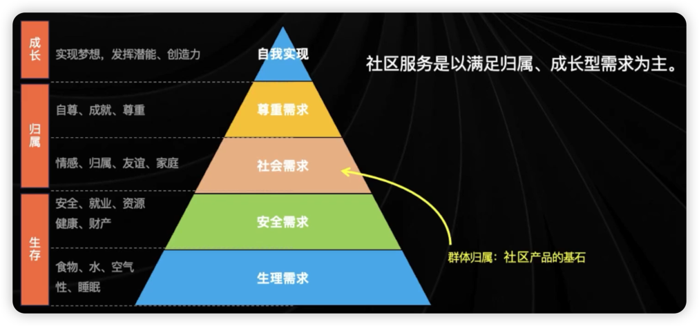

马斯洛需求层次模型

#### 用户使用社区的动机是什么？

- 发现与探索：
    - 寻找答案、解决方案
    - 探索多元世界，获取新知识新见闻
- 连接与归属
    - 发现同好、建立集体人格
    - 扩展社交关系
- 表达与成长
    - 表达自我，输出观点
    - 塑造影响力

### 社区产品的价值

#### 内容价值

- 获取知识
- 辅助决策
- 建立社交

#### 用户价值

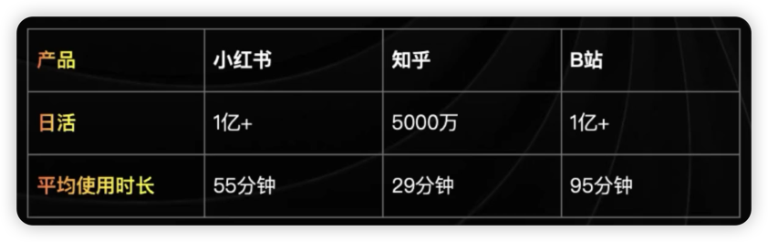

- 用户规模巨大
- 粘性强

#### 商业价值

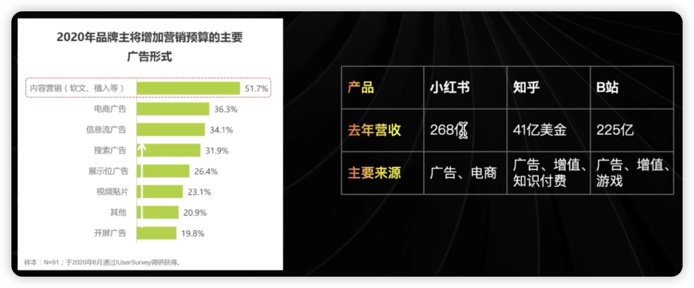

- 广告
- 知识付费
- 增值服务（会员）
- 游戏

## 社区产品的核心要素

当每个人都是城市的创造者时，城市才可能为所有人能提供一些东西——《美国大城市的死与生》

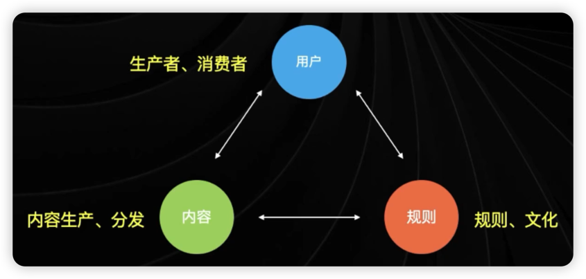

### 用户：相同爱好、诉求的人的聚合

#### 用户角色

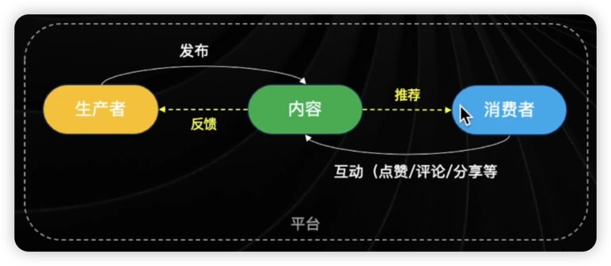

- 内容生产者：负责输出内容
- 内容消费者：消费内容，并与内容、生产者进行互动

两者并非完全独立，可相互转换角色

#### 用户的诉求

生产者诉求：

- 精神诉求：被认同、被尊重、分享观点、炫耀、认识同好、获取社区等级、权限特权
- 物质诉求：获得话语权（KOL）、商业变现（广告、带货等）、成为简历、经历背书

消费者诉求：

- 精神诉求：发掘新知、交流兴趣、形成弱关系的社交
- 物质诉求：消费决策、省钱、薅羊毛

思考：两类用户如何引入、留存？从上述的精神以及物质诉求中去发掘

#### 用户的构成比例

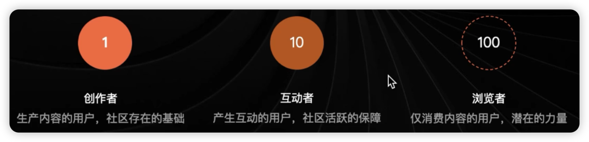

- 生产者：创作者
- 消费者：互动者、浏览者

创作者：社区存活的关键，决定社区内容的标杆，需要重点激励、引导优秀创作者的生产

互动者：决定社区活跃度的水平，创作者的动力来源，刺激其转变为创造者

浏览者：社区价值指标之一，可能转化为互动者、创作者，与前两者数量、质量息息相关

#### 用户的关系链

非对称：单向关注，话语权不对等

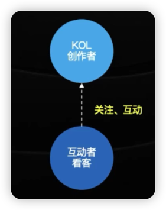

对称：消费者之间平等交流

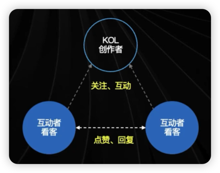

### 内容：PGC、UGC 内容生产和消费

#### 内容的范围

内容的主体：文字、图片、音频、视频

其他内容：评论、点赞/踩、转发、评价、回答等等

#### 内容的时效性

天气：具有明显的时效性

- 可能有短期的流量、吸引力，但是无沉淀价值，无法反复消费

管理知识：无时效性

- 中长期价值较大，强沉淀价值，可以反复消费、甚至变成热门内容

#### 内容的分发形式

话题信息流：

- 以话题聚合的内容列表，比如豆瓣某个小组的帖子列表
- 排序方式：最新、最近回复、热门

关注信息流：

- 以用户关注的人发布信息组成的内容列表，比如公众号
- 排序方式：发布时间先后、智能排序

推荐信息流：

- 以用户个人特征和行为偏好所聚合成的内容，如小红书
- 排序方式：千人千面，个性化推荐

其他：人工推荐、主动搜索等

- 以编辑人工控制内容的排序、展示与否，比如新闻类
- 排序方式：人工控制、主动发起

#### 内容的生产形式

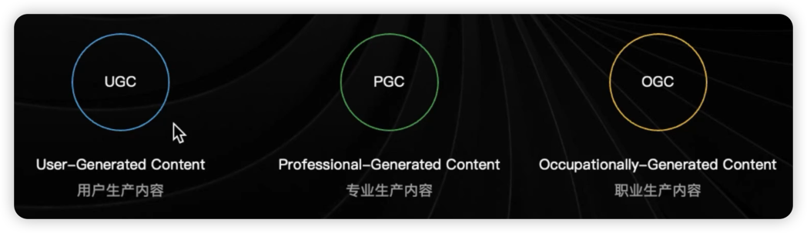

特征：

UGC：真实、低成本、高效、量大、优质内容较少、有监管风险

PGC：高成本、低频、高质量，专业性强、话题较广

OGC：高质量、高成本、可信、话题受限

### 规则：社区运作、内容生产的各种行为准则

社区规则是指社区成员必须遵守的一系列规定和指导原则。这些规则通常是为了维护社区的秩序、保护成员的权益、以及确保社区的健康发展而设立的

- 行为规则：比如不许辱骂、引战、不实信息等
- 内容规则：禁止发布政治敏感信息、黄色内容等，倡导分享真实种草内容、生活经历等
- 商业规则：虚假宣传、水军、诈骗等

社区文化是指社区成员共同认同的价值观、信仰、传统的行为模式。他是社区成员在长期互动过程中形成的，反映了社区的核心精神和特色。通常体现在社区的口号、标志、活动、以及成员的日常交流中。

- B 站：二次元文化、弹幕礼仪、一键三连
- 知乎：精英文化、详见、人在美国刚下飞机
- 虎扑：直男文化、JRs、开会、如来

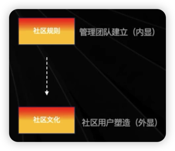
